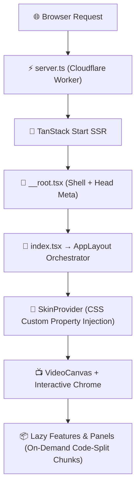

<div align="center">

# 🎬 VLC Web Player
### Enterprise-Grade Browser Media Engine & 100% Offline PWA Suite

[](https://react.dev/)
[](https://tanstack.com/)
[](https://vitejs.dev/)
[](https://tailwindcss.com/)
[](https://www.typescriptlang.org/)
[](https://web.dev/progressive-web-apps/)
[](LICENSE)

<p align="center">
  <b>VLC Web Player</b> is a high-performance, browser-native media player inspired by desktop VLC.<br/>
  It features an advanced Web Audio API graph, 200+ customizable skin variants, an integrated Study Suite, and a 100% offline AAA mini-app engine.
</p>

---

</div>

## 🌟 Key Value Propositions

```
┌─────────────────────────────────────────────────────────────────────────────────────────┐
│                                                                                         │
│  🎥 UNIVERSAL MEDIA ENGINE      Play any video/audio file natively in browser with    │
│                                 SRT/VTT subtitles, A-B loop, and Web Audio EQ graph.   │
│                                                                                         │
│  🎨 200+ SKINS & GOD MODE       12 Base Heroes × 8 Accent Palettes + God Mode CSS       │
│                                 overrides with WCAG AA auto-contrast normalization.     │
│                                                                                         │
│  🕹️ AAA MINI-APP SUITE          Built-in offline tools & games: TCS iON Calculator,    │
│                                 Level 100 Minimax Tic-Tac-Toe, Dino Runner, & Snake.   │
│                                                                                         │
│  🎓 INTEGRATED STUDY HUB        Headless Pomodoro timer, SM-2 flashcard algorithm,      │
│                                 Kanban tasks, markdown notes, and weekly planner.       │
│                                                                                         │
│  🛡️ 100% OFFLINE PWA            Workbox Service Worker precaching with zero-network     │
│                                 cold load and automatic background prewarming.          │
│                                                                                         │
└─────────────────────────────────────────────────────────────────────────────────────────┘
```

---

## 🏗️ Architecture & Data Flow

### 1. Rendering & SSR Pipeline



---

### 2. Web Audio API Processing Graph

```
┌──────────────┐     ┌────────────────────────┐     ┌──────────────────────┐
│  <video> /   │ ──> │ 10-Band BiquadFilter   │ ──> │ Karaoke Mid-Channel  │
│  <audio>     │     │ Equalizer + Preamp     │     │ Phase Eliminator     │
└──────────────┘     └────────────────────────┘     └──────────────────────┘
                                                               │
                                                               ▼
┌──────────────┐     ┌────────────────────────┐     ┌──────────────────────┐
│ AudioContext │ <── │ DelayNode              │ <── │ DynamicsCompressor   │
│ Destination  │     │ Echo & Reverberation   │     │ Threshold Control    │
└──────────────┘     └────────────────────────┘     └──────────────────────┘
```

---

### 3. Cascading Theme & Skin Token Pipeline

```
┌─────────────────────────────────────────────────────────────────┐
│ Layer 1: CSS Base Custom Properties (:root in styles.css)       │
├─────────────────────────────────────────────────────────────────┤
│ Layer 2: Active Skin Tokens ([data-vlc-skinned] via SkinProvider)│
├─────────────────────────────────────────────────────────────────┤
│ Layer 3: God Mode Custom Category Overrides                     │
├─────────────────────────────────────────────────────────────────┤
│ Layer 4: User Custom CSS Style Injections                       │
└─────────────────────────────────────────────────────────────────┘
```

---

## 🛠️ Technology Stack

| Layer | Technology | Version | Purpose |
|---|---|---|---|
| **UI Framework** | React | `^19.2.0` | Declarative UI rendering engine |
| **Meta-Framework** | TanStack Start | `^1.167.50` | Server-Side Rendering (SSR) & routing |
| **Routing** | TanStack Router | `^1.168.25` | Type-safe file-based router |
| **State Management** | Zustand | `^5.0.13` | Deferred hydration stores (`playerStore`, `studyStore`) |
| **Bundler** | Vite | `^7.3.1` | Lightning-fast ESM bundler & code splitting |
| **Styling** | TailwindCSS v4 | `^4.2.1` | Modern utility CSS & design tokens |
| **Animations** | Framer Motion | `^12.40.0` | Physics-based spring animations |
| **Icons** | Lucide React | `^0.575.0` | Crisp vector interface icons |
| **PWA Service Worker** | Workbox Build | `^7.0.0` | 100% offline precaching service worker |
| **Deployment** | Cloudflare Pages | Nitro Preset | High-speed global edge network |

---

## 📁 Codebase Directory Blueprint

```
girish09-main/
├── public/                          # Static assets served at root
│   ├── icons/                       # PWA icon set (32, 180, 192, 512)
│   ├── vendor/                      # Vendored tools (TCS iON Scientific Calculator)
│   └── manifest.webmanifest         # PWA Manifest configuration
├── scripts/                         # Build & CI utilities
│   ├── audit-contrast.mjs           # WCAG contrast compliance auditor
│   └── build-sw.mjs                 # Post-build Workbox Service Worker bundler
├── src/
│   ├── audio/
│   │   └── AudioGraph.ts            # Web Audio API graph (10-band EQ, compressor, karaoke, delay)
│   ├── components/
│   │   ├── controls/
│   │   │   ├── ControlBar.tsx        # Transport control bar (play, volume, track toggles)
│   │   │   └── VolumeKnob.tsx        # Volume slider with 200% boost indicator
│   │   ├── dialogs/
│   │   │   └── CommandPalette.tsx     # Ctrl+K fuzzy search command palette
│   │   ├── layout/
│   │   │   ├── AppLayout.tsx          # ★ Root orchestrator component
│   │   │   ├── MenuBar.tsx            # Desktop menu bar (Media, Audio, Video, Tools)
│   │   │   ├── OfflineStatusIndicator.tsx # Offline status toast indicator
│   │   │   └── TitleBar.tsx           # Window title bar with metadata pills
│   │   ├── panels/
│   │   │   ├── CodecInfoPanel.tsx     # Codec & resolution metadata viewer
│   │   │   ├── EffectsPanel.tsx       # Video filters & 10-band audio EQ
│   │   │   └── PreferencesPanel.tsx   # Mega settings panel (Skins, A11y, Layout)
│   │   ├── seekbar/
│   │   │   └── SeekBar.tsx            # Scrubber with bookmark pins & A-B loop marker
│   │   ├── study/
│   │   │   ├── StudyEngine.tsx        # Headless Pomodoro timer engine
│   │   │   └── StudyHub.tsx           # Study suite (tasks, notes, flashcards, planner)
│   │   └── video/
│   │       ├── EmptyState.tsx         # Welcome dropzone screen
│   │       ├── OSDDisplay.tsx         # On-screen toast notification overlays
│   │       └── VideoCanvas.tsx        # HTML5 <video> canvas & touch interaction layer
│   ├── features/                     # Retained mini-app features
│   │   ├── FeatureHost.tsx            # Floating panel host for mini-apps
│   │   ├── registry.ts               # ★ Central registry of mini-apps
│   │   ├── scicalc/                  # Official TCS iON Scientific Calculator
│   │   ├── tictactoe/                # Level 100 Minimax AI Tic-Tac-Toe Engine
│   │   ├── dino/                     # 60FPS Dino Runner Engine
│   │   ├── snake/                    # Custom Snake Classic Engine
│   │   └── dice/                     # 3D Animated Dice Roller
│   ├── hooks/
│   │   ├── useKeyboardShortcuts.ts   # Global VLC-matching keyboard shortcuts
│   │   ├── useOnlineStatus.ts        # Navigator online/offline state listener
│   │   └── useVideoPlayer.ts         # Core video element wiring & MediaSession API
│   ├── pwa/
│   │   ├── registerSW.ts             # Service worker registration & update channel
│   │   └── warmCache.ts              # 100% offline feature chunk prewarming
│   ├── skins/
│   │   ├── SkinProvider.tsx           # Dynamic CSS token injector
│   │   ├── contrast.ts               # WCAG contrast normalization
│   │   └── registry.ts               # 200+ skin variants catalog
│   ├── store/
│   │   ├── playerStore.ts            # Main Zustand store (playback, UI, themes, EQ)
│   │   └── studyStore.ts             # Study Hub Zustand store (tasks, flashcards)
│   ├── styles.css                    # Global CSS design tokens & Tailwind bridge
│   └── routes/
│       └── __root.tsx                # TanStack Router root route shell
```

---

## ⚡ Quick Start & Development

### 1. Prerequisites
- **Node.js**: `v18.0.0` or higher
- **npm**: `v9.0.0` or higher

### 2. Installation & Launch

```bash
# Clone repository
git clone https://github.com/Girish12277/girish10.git
cd girish10

# Install dependencies
npm install

# Start local development server
npm run dev
```

Open [http://localhost:5173](http://localhost:5173) in your browser.

---

### 3. Production PWA Build

```bash
# Compile client bundles, SSR worker, and precache service worker
npm run build

# Preview production build locally
npm run preview
```

---

## ⌨️ Global Keyboard Shortcuts

| Shortcut | Action |
|---|---|
| <kbd>Space</kbd> / <kbd>K</kbd> | Toggle Play / Pause |
| <kbd>F</kbd> | Toggle Fullscreen |
| <kbd>M</kbd> | Toggle Mute |
| <kbd>Ctrl</kbd> + <kbd>K</kbd> | Open Command Palette |
| <kbd>Arrow Left</kbd> / <kbd>Arrow Right</kbd> | Seek ±5 seconds |
| <kbd>Arrow Up</kbd> / <kbd>Arrow Down</kbd> | Volume ±5% |
| <kbd>E</kbd> | Open Effects & EQ Panel |
| <kbd>P</kbd> | Toggle Playlist Panel |
| <kbd>Ctrl</kbd> + <kbd>,</kbd> | Open Preferences Panel |

---

## 📜 License

Distributed under the **MIT License**. See `LICENSE` for more information.

<div align="center">
  <sub>Built with ❤️ by the open-source community. Designed for speed, privacy, and 100% offline reliability.</sub>
</div>